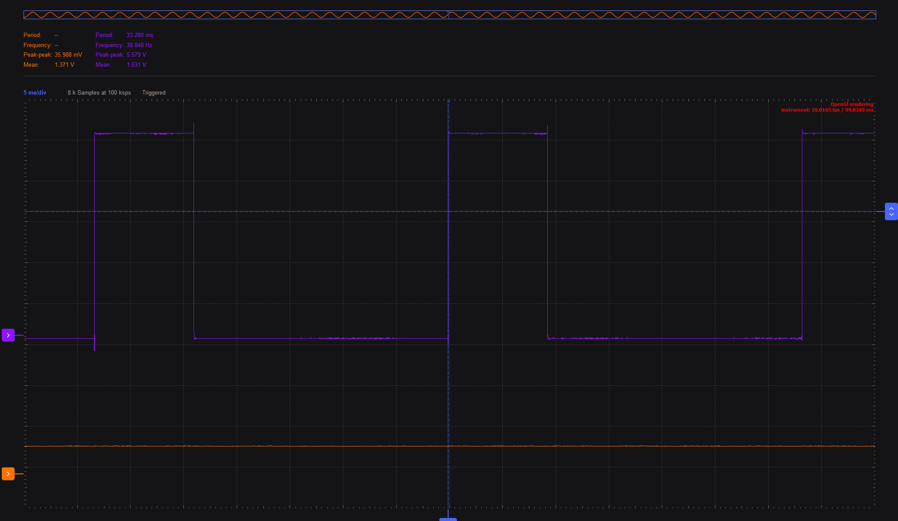
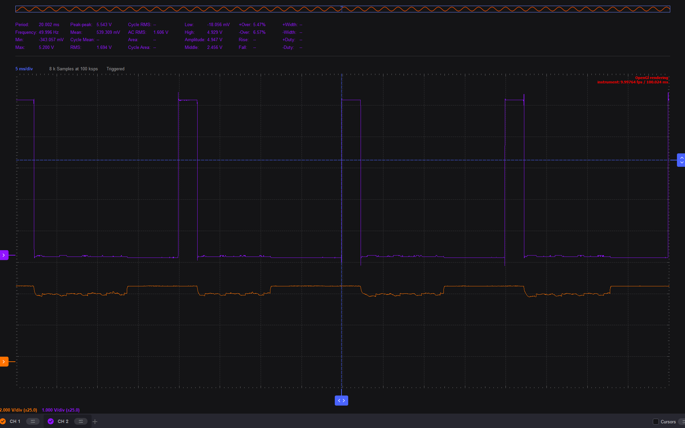

# Project7 - Analog!

1. Understand the difference between analog and digital signals
1. Learn to use a voltmeter and scope
1. Measure analog signals
1. Understand PWM and when to use it
1. Learn about MD_PWM package
1. Learn about servo motors
1. Understand arduino signal capabilities

## Adding a dimmer functionality to the LED

The purpose of this project is to dim and increase the led light using the rotary button.

- rotary is A0 in Arduino. connect gnd (in arduino) first to orange with stripe (in ADALM) and then A0 to orange.
- Use voltmeter in Scopy to see range of values when turning the rotary. 
- create an Arduino file that reads the values from the rotary and prints them out. What is the range of the values? 0-1020
- pin 4 (grove LED) is not supported for PWM. Install package MD_PWM, and set pin 4 to be PWM using the package documentation.
- Using the rotary value, update the PWM value. Note the range of values that can be used according to package documentation. Change your code accordingly.
- test your code.
- View in scope: Connect Analog 2 (dark blue) to pin 4 in arduino (LED output). Play with the times and triggers until you see the PWM change when turning the rotary.  What is the duty cycle? the duty cycle varies according to the rotatory..
- View in voltmeter - stop scope first. See the average voltage change. What does it mean?the voltage between 0-5 is like the duty 0-100%
- what happens when using 30Hz instead of 50Hz for the PWM?
- paste a screenshot of the oscilloscope where both the rotary potentiometer signal and the PWM signal on the led are seen.

## Use PWM to control a servo motor

Documentation on Servo [here](https://wiki.seeedstudio.com/Grove-Servo/)

- connect analog 2 in adalm (dark blue) to digital 7 in arduino
- install Servo package if not already installed
- initialize Servo package with pin 7
- first check in adalm the range of the mapped values. What frequency is the Servo package using? it is using 50Hz freq
- connect to servo using D7 breakout (ground on the left on the side of the led). connect plus to servo
- turn rotary to turn the servo
- How does the range of the duty cycle in servo motor compare to the range of the duty cycle we used in the LED? Use the scope. the range of the duty is between 10%, you cannot go above it.
- is the range of angles in our servo the same as the range of the angles in the Servo package? change the range of values to the servo accordingly.
- Paste a screenshot of the scope showing the maximum duty cycle of the servo (the maximum angle the servo succeeded rotating without problems)

## Exercises
 - Comparison of AI changes if any:
- commit and push both .ino files and their folders to your repository

